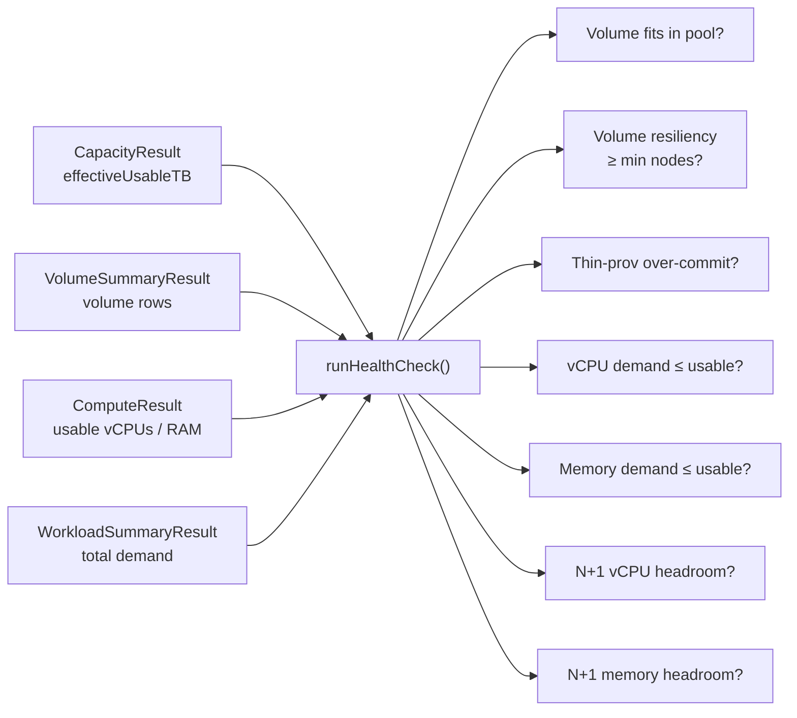

# Engine Data Flow

This page traces the path from raw user input through to every output that Surveyor produces.

---

## End-to-end pipeline

```mermaid
flowchart TD
    U(("User inputs\nHardware · Workloads\nAVD · SOFS · AKS\nMABS · Volumes"))

    subgraph Store ["Zustand Store (persisted)"]
        S_HW["hardware\nadvanced"]
        S_WL["virtualMachines\nservicePresets\ncustomWorkloads"]
        S_AVD["avd · avdEnabled"]
        S_SOFS["sofs · sofsEnabled"]
        S_AKS["aks"]
        S_MABS["mabs · mabsEnabled"]
        S_VOL["volumes\nvolumeMod"]
    end

    subgraph EngineCore ["Core Engine"]
        CAP["computeCapacity()\n→ CapacityResult"]
        COMP["computeCompute()\n→ ComputeResult"]
        VOL["computeVolumeSummary()\n→ VolumeSummaryResult"]
    end

    subgraph WorkloadEngine ["Workload Engine"]
        AVD_E["computeAvd()\n→ AvdResult"]
        SOFS_E["computeSofs()\n→ SofsResult"]
        AKS_E["computeAks()\n→ AksResult"]
        MABS_E["computeMabs()\n→ MabsResult"]
        SP_E["computeAllServicePresets()\n→ ServicePresetTotals"]
        CW_E["computeAllCustomWorkloads()\n→ CustomTotals"]
        WL_E["computeWorkloadTotals()\n→ WorkloadSummaryResult"]
    end

    HC["runHealthCheck()\n→ HealthCheckResult"]

    subgraph Reports ["Reports (ReportsPage)"]
        CR["CapacityReport"]
        COMPR["ComputeReport"]
        FR["FinalReport"]
        HCR["HealthCheck"]
        SR["SofsReport"]
    end

    subgraph Exporters ["Exporters (FinalReport)"]
        PDF["pdf.ts → .pdf"]
        XLSX["xlsx.ts → .xlsx"]
        MD["markdown.ts → .md"]
        PS["powershell.ts → .ps1"]
        JSON["json.ts → SurveyorPlan .json"]
    end

    U --> Store

    S_HW --> CAP
    S_HW --> COMP
    S_VOL --> VOL
    CAP --> VOL

    S_AVD --> AVD_E
    S_SOFS --> SOFS_E
    S_AKS --> AKS_E
    S_MABS --> MABS_E
    S_WL --> SP_E
    S_WL --> CW_E

    AVD_E --> WL_E
    SOFS_E --> WL_E
    AKS_E --> WL_E
    MABS_E --> WL_E
    SP_E --> WL_E
    CW_E --> WL_E

    CAP --> HC
    COMP --> HC
    VOL --> HC
    WL_E --> HC

    CAP --> CR
    COMP --> COMPR
    VOL --> FR
    WL_E --> FR
    HC --> HCR
    SOFS_E --> SR

    CAP --> PDF
    COMP --> PDF
    WL_E --> PDF
    HC --> PDF
    AVD_E --> PDF
    SOFS_E --> PDF

    CAP --> XLSX
    COMP --> XLSX
    WL_E --> XLSX
    AVD_E --> XLSX
    SOFS_E --> XLSX

    CAP --> MD
    WL_E --> MD
    AVD_E --> MD
    SOFS_E --> MD

    CAP --> PS
    VOL --> PS

    CAP --> JSON
    COMP --> JSON
    VOL --> JSON
    WL_E --> JSON
    HC --> JSON
    AVD_E --> JSON
    SOFS_E --> JSON
    AKS_E --> JSON
    MABS_E --> JSON
```



---

## Capacity computation chain

```
HardwareInputs
  │
  ├── nodeCount × capacityDrivesPerNode × capacityDriveSizeTB × efficiencyFactor
  │     └─→ usablePerDriveTB (or driveUsableTb override)
  │
  ├── usablePerDriveTB × totalDrives
  │     └─→ totalUsableTB
  │
  ├── − reserveTB  (min(nodeCount, 4) × usablePerDriveTB)
  │
  ├── − infraVolumeTB  (infraVolumeSizeTB / resiliencyFactor)
  │     └─→ availableForVolumesTB
  │
  └── × resiliencyFactor
        └─→ effectiveUsableTB  ← planning number (Calculator TB)
```

The `effectiveUsableTB` is a **Calculator TB** value (1 TB = 10¹² bytes as per the
Excel workbook model). WAC GB conversion is applied per-volume:

$$\text{WAC GB} = \lfloor \text{volumeSizeTB} \times 1000 \rfloor$$

---

## Workload aggregation chain

Each workload engine produces a `{vcpus, memoryGB, storageTB}` triple. The
`computeWorkloadTotals()` function sums across all enabled scenarios:

```
vmScenarioTotals(virtualMachines)      → { vcpus, memGB, storageTB }
+ avdEnabled  → computeAvd()                → { vcpus, memGB, storageTB }
+ sofsEnabled → computeSofs()               → { vcpus, memGB, storageTB }
+ aks.enabled → computeAks()                → { vcpus, memGB, storageTB }
+ mabsEnabled → computeMabs()               → { vcpus, memGB, storageTB }
+ computeAllServicePresets(servicePresets)  → { vcpus, memGB, storageTB }
+ computeAllCustomWorkloads(customWorkloads)→ { vcpus, memGB, storageTB }
                                              ─────────────────────────
                                            WorkloadSummaryResult.totals
```

The `WorkloadSummaryResult` flows into:
- the Workload Planner totals bar (live, on every keystroke)
- the Final Report summary table
- the health check CPU/RAM fit checks
- all five exporters

---

## Health check evaluation

`runHealthCheck()` takes the frozen outputs of the core and workload engines and
produces a list of `HealthCheckResult` items, each with a `pass | warn | fail`
status and a reason string.



---

## Volume suggestion flow (workload mode)

When `volumeMode = "workload"`, the volume table is **derived** from enabled
workloads — volume rows are not user-editable; they are rebuilt from engine outputs.

```
WorkloadSummaryResult
  └── workload-volumes.ts → generateWorkloadVolumes()
        ├── Infra CSV      (always)
        ├── User VMs       (when virtualMachines.enabled)
        ├── AVD-Sessions   (when avdEnabled)
        ├── AVD-Profiles   (when avdEnabled + profiles on S2D)
        ├── SOFS-VMs       (when sofsEnabled)
        ├── AKS-OS         (when aks.enabled)
        ├── AKS-PVCs       (when aks.enabled + persistentVolumesTB > 0)
        ├── AKS-DataSvcs   (when aks.enabled + dataServicesTB > 0)
        ├── MABS-Data      (when mabsEnabled)
        ├── MABS-Internal  (when mabsEnabled + internalMirrorFactor > 1)
        ├── ServicePresets (one row per enabled preset)
        └── CustomWorkloads (one row per enabled custom workload)
```

In `volumeMode = "generic"` the user adds and edits volumes directly — workload
volumes are not generated.

---

## Override handling

The `advanced.overrides` object allows specific formula-calculated values to be
replaced with user-supplied constants. Pattern: `IF(override != 0, override, formula)`.

| Override key | Replaces |
|---|---|
| `driveUsableTb` | `capacityDriveSizeTB × efficiencyFactor` |
| `avdSessionHostsNeeded` | `ceil(users / density)` in `computeAvd()` |
| `avdProfileLogicalTb` | `users × profileSizeGB / 1024` in `computeAvd()` |
| `sofsProfileDemandTb` | `userCount × profileSizeGB / 1024` in `computeSofs()` |

All other override keys from the workbook (38 total) are deferred. See
[formula-map.md](../reference/formula-map.md) and `engine-spec.json` →
`overrideGap` for the full deferred list.

---

## Advanced Settings impact

Advanced Settings (`src/engine/types.ts → DEFAULT_ADVANCED_SETTINGS`) affect
calculations globally:

| Setting | Affected engine(s) | Effect |
|---|---|---|
| `capacityEfficiencyFactor` | `capacity.ts` | Per-drive efficiency multiplier (default 0.92) |
| `infraVolumeSizeTB` | `capacity.ts` | Infrastructure CSV pool footprint |
| `vCpuOversubscriptionRatio` | `compute.ts` | Logical vCPU multiplier (default 4) |
| `systemReservedMemoryGB` | `compute.ts` | Per-node OS + Hyper-V RAM reservation (default 8 GB) |
| `systemReservedVCpus` | `compute.ts` | Per-node system vCPU reservation (default 4) |
| `defaultResiliency` | `capacity.ts`, `volumes.ts` | Fallback resiliency type |
| `overrides.*` | multiple | See override table above |
