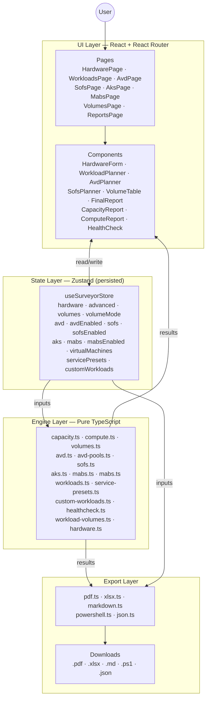
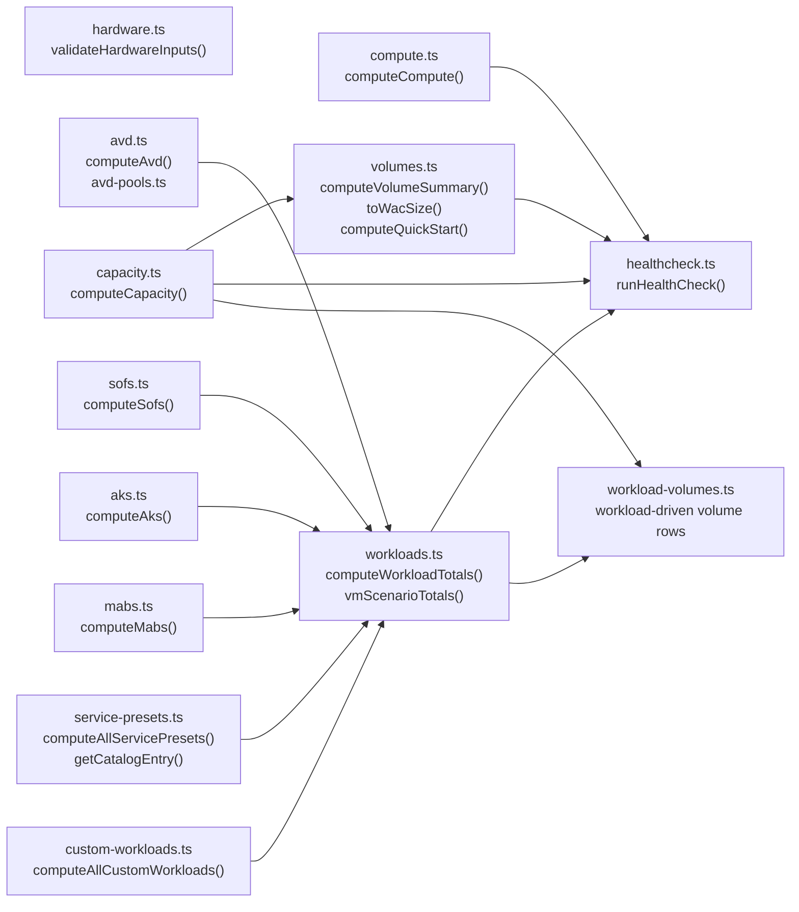

# Architecture Overview

Azure Local Surveyor is a single-page React application that translates the
`S2D_Capacity_Calculator.xlsx` workbook into a typed, versioned, browser-resident
planning tool. This page describes the four main layers and how they fit together.

---

## Layers

---

## UI Layer

**Pages** (`src/pages/`) are React Router route components. Each page initialises
its section of the store and delegates planning UI to one or more components.

| Page | Components used | Primary engine call |
|---|---|---|
| `HardwarePage` | `HardwareForm`, `AdvancedSettings` | — (inputs only) |
| `WorkloadsPage` | `WorkloadPlanner` | `computeCapacity`, `computeAvd`, `computeAks`, `computeSofs`, `computeMabs`, `computeWorkloadTotals` |
| `AvdPage` | `AvdPlanner` | `computeAvd` |
| `SofsPage` | `SofsPlanner`, `SofsReport` | `computeSofs` |
| `AksPage` | inline | `computeAks` |
| `MabsPage` | inline | `computeMabs` |
| `VolumesPage` | `VolumeTable` | `computeVolumeSummary`, `computeQuickStart` |
| `ReportsPage` | `CapacityReport`, `ComputeReport`, `FinalReport`, `HealthCheck`, `SofsReport` | all engine modules |

**Components** (`src/components/`) are self-contained UI units. They read from the
Zustand store, call engine functions for display, and write back to the store on
user input. Components never hold derived state — every derived value is computed
on each render from the current store snapshot.

---

## State Layer

`src/state/store.ts` is a single Zustand store that is persisted to `localStorage`
with versioned migrations. Every user-editable field lives here; computed results
are never stored — they are re-derived on every render.

| Store slice | Shape | Default source |
|---|---|---|
| `hardware` | `HardwareInputs` | `DEFAULT_HARDWARE` in `types.ts` |
| `advanced` | `AdvancedSettings` | `DEFAULT_ADVANCED_SETTINGS` in `types.ts` |
| `volumes` | `VolumeSpec[]` | `[]` |
| `volumeMode` | `"workload" \| "generic"` | `"workload"` |
| `avd` | `AvdInputs` (with `pools[]`) | single pool, 100 users |
| `avdEnabled` | `boolean` | `false` |
| `sofs` | `SofsInputs` | defaults in `types.ts` |
| `sofsEnabled` | `boolean` | `false` |
| `aks` | `AksInputs` (with `aks.enabled`) | 1 cluster, 3 control, 3 workers |
| `mabs` | `MabsInputs` | defaults in `types.ts` |
| `mabsEnabled` | `boolean` | `false` |
| `virtualMachines` | `VmScenario` | `enabled: false` |
| `servicePresets` | `ServicePresetInstance[]` | `[]` |
| `customWorkloads` | `CustomWorkload[]` | `[]` |

The store uses **version 8** (as of v1.5.0). Migrations run on startup if the
persisted version is older; see `store.ts` for the migration chain.

---

## Engine Layer

All engine functions are **pure** — they take typed inputs and return typed results
with no side-effects, no React imports, and no global state. This makes them trivial
to test independently and safe to call from both UI components and exporters.

### Module dependency graph

### Key interfaces

All input and result types are defined in `src/engine/types.ts`.
The type file is the single authoritative reference for:
- all `*Inputs` shapes (user-editable fields)
- all `*Result` shapes (engine outputs)
- shared enums: `ResiliencyType`, `DriveMedia`, `AvdWorkloadType`
- `DEFAULT_HARDWARE` and `DEFAULT_ADVANCED_SETTINGS` constants

---

## Export Layer

`src/exporters/` contains five export functions, one per format.
All exporters are called from `FinalReport.tsx` and receive the same `state`
object (a `Pick<SurveyorState, ...>` containing all relevant store slices).
Each exporter re-runs the engine to compute a fresh, consistent snapshot —
nothing is cached between UI renders and export.

| File | Format | Key output |
|---|---|---|
| `pdf.ts` | PDF | Multi-section report with all planner results |
| `xlsx.ts` | Excel | Multi-sheet workbook with hardware, capacity, workloads, AVD, SOFS |
| `markdown.ts` | Markdown | Human-readable planning summary |
| `powershell.ts` | PowerShell | `New-Volume` commands for all planned volumes |
| `json.ts` | JSON | Versioned `SurveyorPlan` manifest (see [plan-manifest.md](../reference/plan-manifest.md)) |

The JSON exporter is the primary **machine-readable handoff artifact**. Its schema
is versioned independently of the app version — see [plan-manifest.md](../reference/plan-manifest.md)
for the full schema and Ranger integration notes.

---

## OEM Hardware Presets

`src/engine/presets/` contains static hardware preset files for OEM server models.
Selecting a preset in `HardwareForm` populates the hardware inputs in one click.
Presets are verified against Microsoft's official Azure Local hardware catalog.

| File | Models |
|---|---|
| `dell-ax.ts` | AX-650, AX-750, AX-760, AX-670, AX-770 |
| `lenovo-mx.ts` | MX3530-H, MX3530-F, MX3535 |
| `hpe-proliant.ts` | DL380 Gen11, EL8000 |
| `dataon.ts` | S2D-5212, S2D-4112 |

---

## Share URL

The app supports a share URL that base64-encodes the current Zustand store state
into the URL hash. This allows a complete plan to be shared as a single URL without
any server-side storage. The share URL is a UI convenience; for durable baseline
artifacts use the JSON export.
